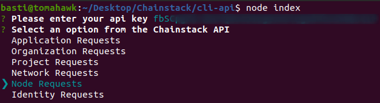
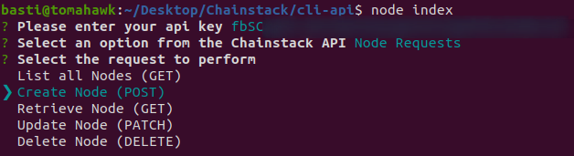
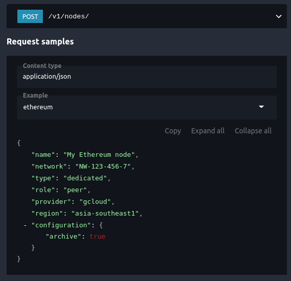
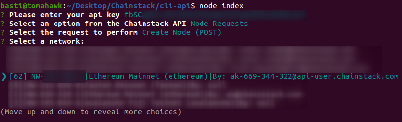
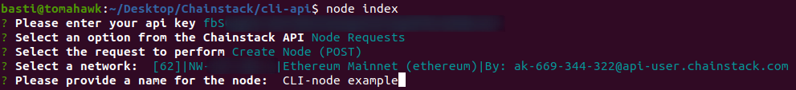
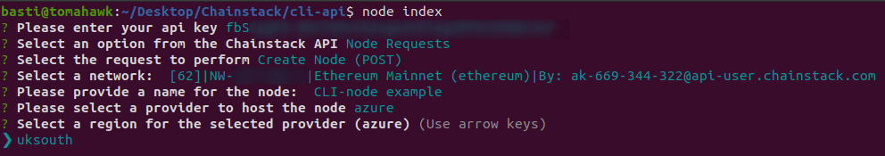
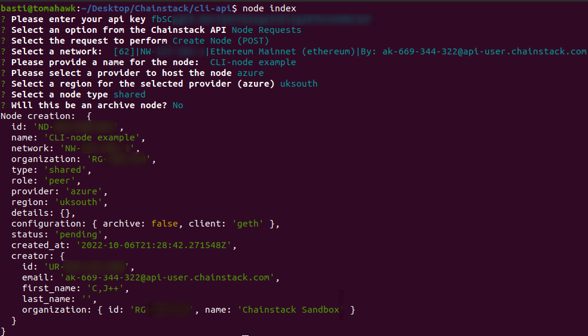
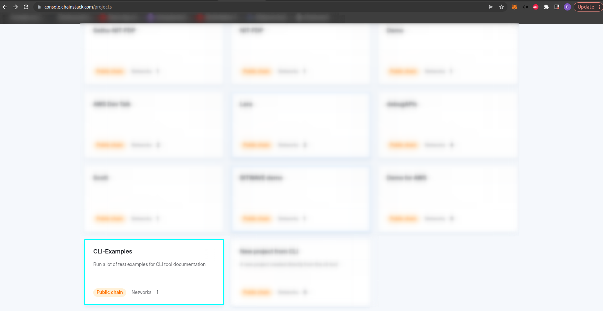
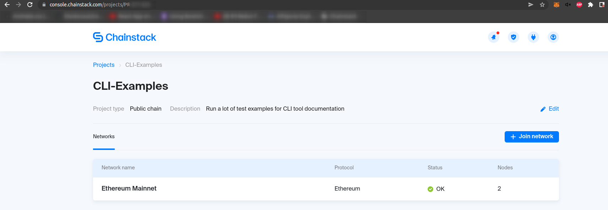
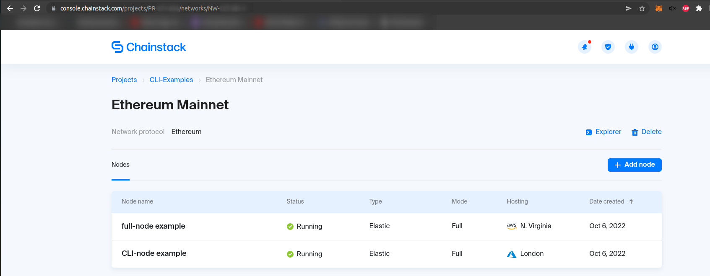

# Creating a new Ethereum node

---

Lets say we want to create a new Ethereum full node. First, in the project's root folder, open a terminal and run:

```
node index
```

A new input will be prompted asking for your Chainstack's api key. You can get yours from [Chainstack console](https://console.chainstack.com/user/settings/api-keys).


After that, you can get to choose any of the requests specified in the [api reference documentation](https://docs.chainstack.com/api/reference/):



Select **Node Requests**, then **Create Node**.



If we check the documentation reference for [creating a network](https://docs.chainstack.com/api/reference/#operation/createNetwork), it requires a few parameters in JSON format. Paramaters differs on some networks, but for **EVM based** networks (like Ethereum) they are pretty much the same:



Now, you will be prompted to select all of this parameters as inputs to succesfully create a new ethereum network. First, a **network is needed**, since a network ID is required as param. Networkis list will vary depending on the organization you are in, so be sure to [create a new network](../create-network/README.md) **before creating nodes**.



In this example we will create just one full node, but you can try creating a few more if needed. First a name is required for the node:



Then, a provider and a region from the provider is required. Regions will vary depending on the provider you choose. Please refer to the [creating nodes reference](https://docs.chainstack.com/api/reference/#operation/createNode) for further details. In this case, we'll select azure from the provider list, and uksouth as region.




Now we need to choose the type of node to create. Currently, **only shared nodes are supported**.


Finally we need to set if the node will be in archive mode. In this example **we'll select NO**, as we are creating a full node.


And thats it! If everything goes well, you shall see this kind of output from the terminal.



Now if we go to the [Chainstack's console](https://console.chainstack.com/) we can see that a new full node was created under our network.




