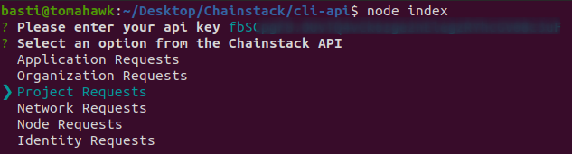
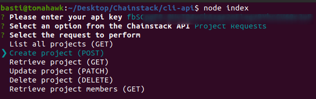
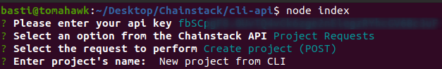
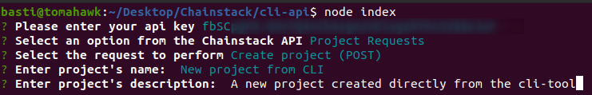
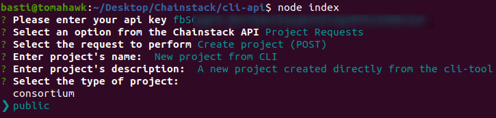
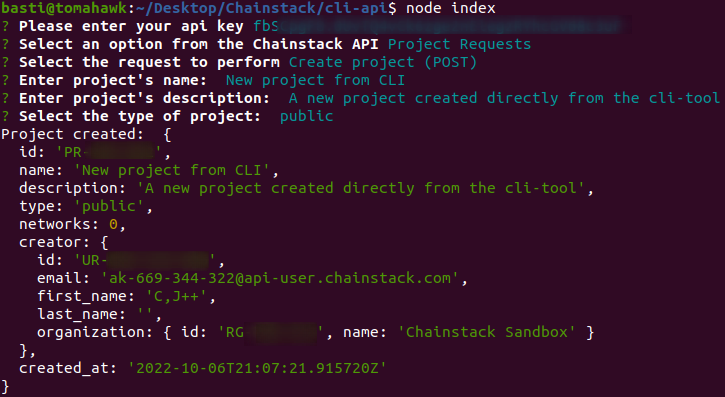
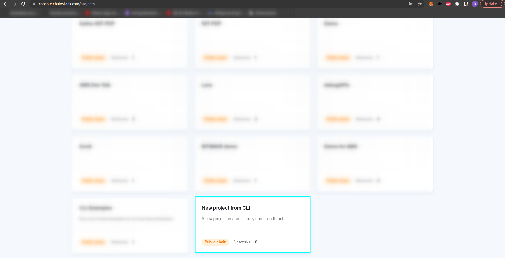

# Creating a new Ethereum network

---

Lets say we want to create a new Ethereum network, initially with a full node. First, in the project's root folder, open a terminal and run:

```
node index
```

A new input will be prompted asking for your Chainstack's api key. You can get yours from [Chainstack console](https://console.chainstack.com/user/settings/api-keys).


After that, you can get to choose any of the requests specified in the [api reference documentation](https://docs.chainstack.com/api/reference/):



Select **Project Requests**, then **Create Project**.



If we check the documentation reference for [creating a project](https://docs.chainstack.com/api/reference/#operation/createProject), it requires a few parameters in JSON format.


Now, you will be prompted to select all of this parameters as inputs to succesfully create a new ethereum network. First, you will be prompted to input a name for the project and then a description.





Finally, you'll be asked to select between a consortium and a public project.



If everything went correctly you shall see an output like this from the console.



You can check in the [Chainstack's console](https://console.chainstack.com/) that the project was created succesfully.


